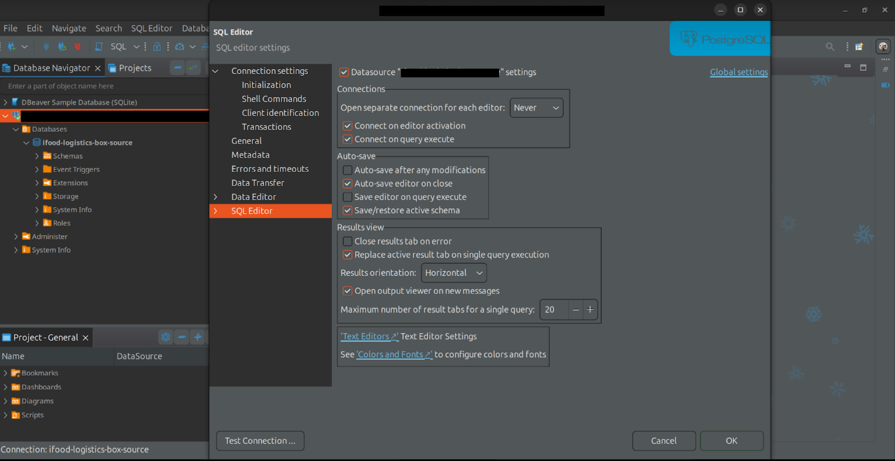
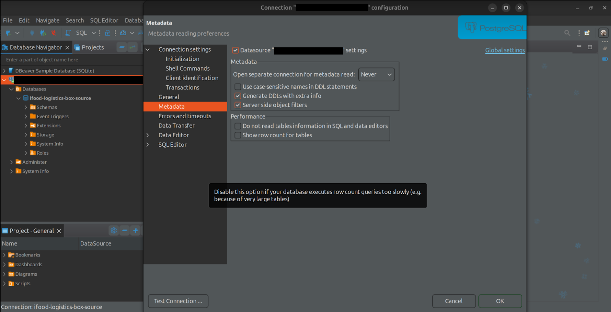

# Proposal
- Document notes about my learnings and experiences;
- Share knowledge with the community;
- Make it easier for me to write, find, and review notes; 
- Bit by bit, I'll translate and add old notes that I have kept in my Google Docs since September 2017.

## PostgreSQL
- PostgreSQL Data Types for Numbers
  - Integer Types
    - **`smallint`**
      - Stores small integers.
      - Range: -32,768 to 32,767.
    - **`integer` (or `int`)**
      - Default integer type.
      - Range: -2,147,483,648 to 2,147,483,647.
    - **`bigint`**
      - Stores large integers.
      - Range: -9,223,372,036,854,775,808 to 9,223,372,036,854,775,807.
  - Serial Types
    - **`smallserial`**
      - Auto-incrementing small integers.
      - Range: 1 to 32,767.
    - **`serial`**
      - Auto-incrementing standard integers.
      - Range: 1 to 2,147,483,647.
    - **`bigserial`**
      - Auto-incrementing large integers.
      - Range: 1 to 9,223,372,036,854,775,807.
  - Floating-Point Types
    - **`real`**
      - Single-precision floating-point number.
      - Approximate range: 6 decimal digits.
    - **`double precision`**
      - Double-precision floating-point number.
      - Approximate range: 15 decimal digits.
  - Numeric Types
    - **`numeric` (or `decimal`)**
      - Exact precision and scale.
      - Use for precise calculations, such as financial data.

## Programming
- Difference Between `float` and `double`
  - Precision
    - **`float`**: Single precision, accurate up to 7 significant digits.
    - **`double`**: Double precision, accurate up to 15-16 significant digits.
  - Memory Size
    - **`float`**: Occupies 4 bytes (32 bits).
    - **`double`**: Occupies 8 bytes (64 bits).
  - Value Range
    - **`float`**: ±1.5 × 10⁻⁴⁵ to ±3.4 × 10³⁸.
    - **`double`**: ±5.0 × 10⁻³²⁴ to ±1.7 × 10³⁰⁸.
  - Performance
    - **`float`**: Faster and consumes less memory, suitable for resource-constrained environments.
    - **`double`**: Slower but more precise, ideal for high-accuracy calculations.
  - Usage Scenarios
    - **`float`**: Use for applications where memory and speed are more critical than precision (e.g., graphics, embedded systems).
    - **`double`**: Use for applications requiring high precision (e.g., scientific or financial computations).

## Nest
- HTTPCode decorator and Httpstatus Enum
  - Instead of using
    ```js
      @ApiResponse({ status: 204 })
    ```
  - Use
    ```js
       @ApiNoContentResponse()
    ```
  - Why not use:
    ```js
    @HttpCode(HttpStatus.NO_CONTENT)
    ```
  - A method decorated with @Get, @Post etc. should specify the expected ApiResponse e.g. @ApiOkResponse(type: MyType). These decorators are in the @nestjs/swagger npm package.eslint@darraghor/nestjs-typed/api-method-should-specify-api-response
## Git
- Which commit message pattern is correct?
  - `fix: Header on LDL Pause/Resume request`
  - `fix: Fix Header on LDL Pause/Resume request`
  - The first one, it's concise and avoids redundancy.
- Difference git config --local --global --system and no flag.
  - **`git config --system`**: Configures Git **system-wide** for all users on the computer. Requires admin/root access. Stores settings in `/etc/gitconfig`.
  - **`git config --global`**: Configures Git **globally** for the current user. No special permissions needed. Stores settings in `~/.gitconfig`.
  - Precedence: Local (--local) > Global (--global) > System (--system).
  - Without flag means global
  - **Precedence**: Local (`--local`) > Global (`--global`) > System (`--system`).

## Python
- Identation rules which code is inside a function, for example.
- Function
    ```python
    def myFunction:
      print("Hello World!")
    ```
  - Not necessary open or close curly braces.
  - Not necessary use semicolon in the end of line
  - Necessary the keyword `def` to define a function 
  - Necessary the `two dots` after function name
- For
  ```python
  for num in nums:
        print(num)
  ```
  - Similar to `for in` of javascript
  - But there is no `for of` to iterate indexes
  - To do it, it's necessary range(len(my_array)) or enumerate()
    - Use enumerate() if you need both index and value.
    - Use range(len(array)) only if you need the index and not the value.
    - The performance difference is almost nothing.
  - len()
    - returns the array size
    - it's a function and you need to pass the array as parameter
      - len(my_array)
    - In javascript was different, because it's a property from Array type
      - myArray.length
  - range()
    - function generates a sequence of numbers and is commonly used in loops.
    - range(start, stop, step)
      - start: Starting number (default: 0).
      - stop: Ending number (exclusive, required).
      - step: Increment or decrement (default: 1).
      - It’s memory-efficient because it doesn’t create a list unless explicitly converted with list(range(...))
  - enumerate()
    - The enumerate() function in Python allows you to iterate over an iterable and get both the index and the value of each element.
    - enumerate(iterable, start=0)
    - iterable: The sequence to iterate over.
    - start: The starting index (default is 0).
    ```python
    my_list = ['a', 'b', 'c']
    for index, value in enumerate(my_list):
    print(f"Index: {index}, Value: {value}")
    ```
- Naming functions and array?
  - Python naming conventions (PEP 8):
    - Variables/Functions: snake_case
    - Classes: PascalCase
    - Constants: UPPERCASE
    - Private variables/methods: _single_underscore, __double_underscore
    - Modules/Packages: lowercase_with_underscores
    - Magic methods: __method_name__
      - Example: __init__(), __str__()
- print()
  - It's a function similar to System.out.println() from Java
  - It's a function, remember to use parenthesis
- Traverse dictionary?
  ```python
  for key in my_dict:
    print(key)

  for value in my_dict.values():
    print(value)

  for key, value in my_dict.items():
    print(key, value)
  ```
## Ubuntu
- Issue with session keyring on Ubuntu using biometrics
  - Without using a password, I used biometrics, and then it asked for a password to unlock the session keyring, which is annoying.
  - One solution is not to shut down the computer, so I only need to enter the password the first time I boot up.
  - When locking the screen again, it can be unlocked with biometrics, and it won’t ask for the session keyring again.
  - From time to time, it is recommended to shut down the computer. I feel it starts getting a bit slow sometimes, maybe due to too much data in the cache and RAM.

## DBeaver
- FATAL: too many connections for role "my.username"
  - It was opening a separate connection to fetch the metadata from the database, such as tables and columns.
  - And the server was configured to allow only 1 connection per user
  - To fix that it's necessary to unable open a second connection to download metadata. For me only worked if I changed in 2 places:
    - Right bottom connection > Edit Connection > Metadata > Open separate Connection to Download Metadata > Never
    - Menu > SWLEditor > Open separate Connection to download Metadata > Never
  - The DBeaver version was 23.34
  - Changing only in 1 place, it didn't work.
  - 
  - 

## Shell script
- -z Flag
  ```shell
  if [ -z "$my_variable" ];
    echo "My variable is empty"
    exit 1;
  fi
  ```
  - [ -z "$commit_info" ]: This is a test command that checks if the length of the string stored in commit_info is zero (i.e., if it is empty).
  - -z: This flag checks if the string is of zero length.
  - "$my_variable": This is the variable being checked. The double quotes around the variable ensure that it is treated as a single string, even if it contains spaces or is empty.
- Difference between exit and return
  - Both will stop the execution of script below, but exit will close the terminal too and return not.
  - exit
    - Purpose: Terminates the entire shell script or the current shell session.
    - Scope: Affects the script or shell itself.
    - Exit Code: Sets the exit status (a numerical value) for the script, which can be checked by the calling process.
    - Use Case: Used when you want to stop the execution of the script completely, optionally returning an exit status to the parent process.
    - Example:
      ```bash
      echo "This will print"
      exit 1
      echo "This will not print"
      Output: This will print
      The script ends with an exit code of 1.
      ```
  - return
  - Purpose: Terminates the execution of a function within a shell script and optionally returns a status code to the calling context (inside the script).
  - Scope: Affects only the current function and returns control back to the script.
  - Exit Code: Sets the function's return value, which can be checked by the script using $?.
  - Use Case: Used within functions to indicate their success or failure to the caller.
  - Example:
  ```bash
    my_function() {
        echo "Inside function"
        return 2
        echo "This will not print"
    }
    my_function
    echo "Function returned with status $?"
    ```
  - Output:
    ```
    Inside function
    Function returned with status 2
    ```
## Prompts
- To install tools:
  - Turn on the internet search
  - Search for the most current and recommended way to install $your_tool on ubuntu according to the official documentation
    - This prompt avoid using old intallations way, which can cause troubles after.
    - You always can go to the official documentation, which is the recomended ... 
## HTTP
  - **Body**: The entire content sent in a message, such as an HTTP request.  
  - **Payload**: Only the useful and relevant data within the body that will be processed by the application.
  - **Example**: The body includes metadata and data, while the payload is just the useful content (the data).
  ```json
  {
    "metadata": {
      "timestamp": "2025-01-14T10:00:00Z"
    },
    "data": {
      "name": "Lucas",
      "email": "lucas@example.com"
    }
  }
  ```
## English Notes for Brazilians
- Afim de
  - `In order to`
    - I studied hard in order to pass the exam.
  - Normalmente pode ser substituído por `to`, porém fica mais com menos ênfase e mais casual
    - I studied hard to pass the exam.
- Quando usar may, should, could e suas diferenças:
    - **May**: Permissão ou possibilidade. Ex.: *It may rain later.*  
    - **Should**: Conselho ou expectativa. Ex.: *You should eat healthier.*  
    - **Could**: Possibilidade, habilidade passada ou pedido educado. Ex.: *Could you help me?*
- O que significa numb?
    - "entorpecer", "anestesiar" ou "amortecer", dependendo do contexto.
        - Entorpecer
            - produzir torpor em (alguém ou a si mesmo); estar ou ficar em estado de torpor.
                - sentimento de mal-estar caracterizado pela diminuição da sensibilidade e do movimento; entorpecimento, estupor, insensibilidade.
                - indiferença ou apatia moral; indolência, prostração.
    - Pode singifica "indiferença" também, como na música do Linkin Park
        - "I've become so numb, I can't feel you there"
        - Become so tired, so much more aware
            - aware é consciente
            - self-awareness
                - autoconsciência
                - your ability to perceive and understand the things that make you who you are as an individual, including your personality, actions, values, beliefs, emotions, and thoughts  
    - Físico: "My fingers are numb from the cold."
        - (Meus dedos estão dormentes por causa do frio.)
    - Emocional: "She felt numb after the bad news."
        - (Ela se sentiu entorpecida após a má notícia.)
    - Time may numb the pain.
        - O tempo pode diminuir a dor
            - Diminuir no sentido de amortecer  
