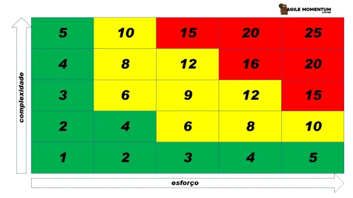
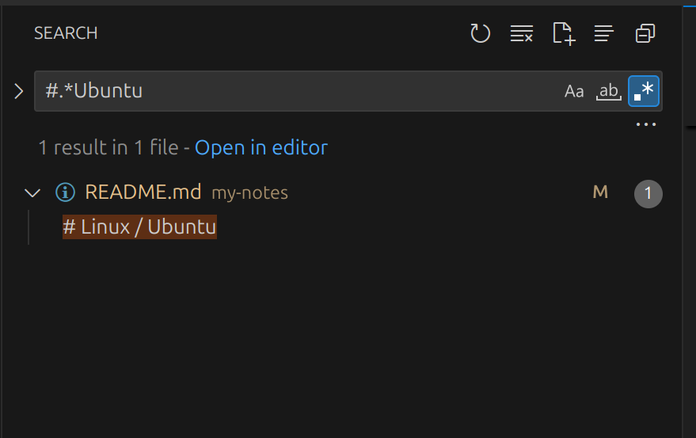
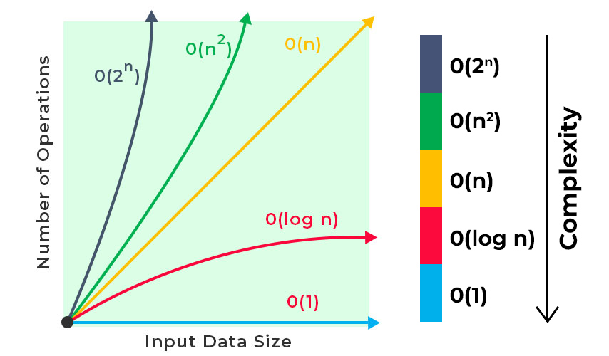
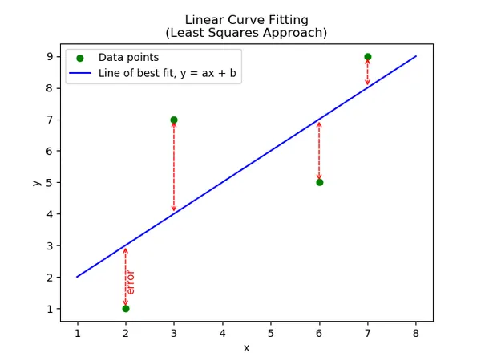
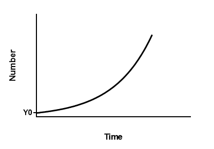
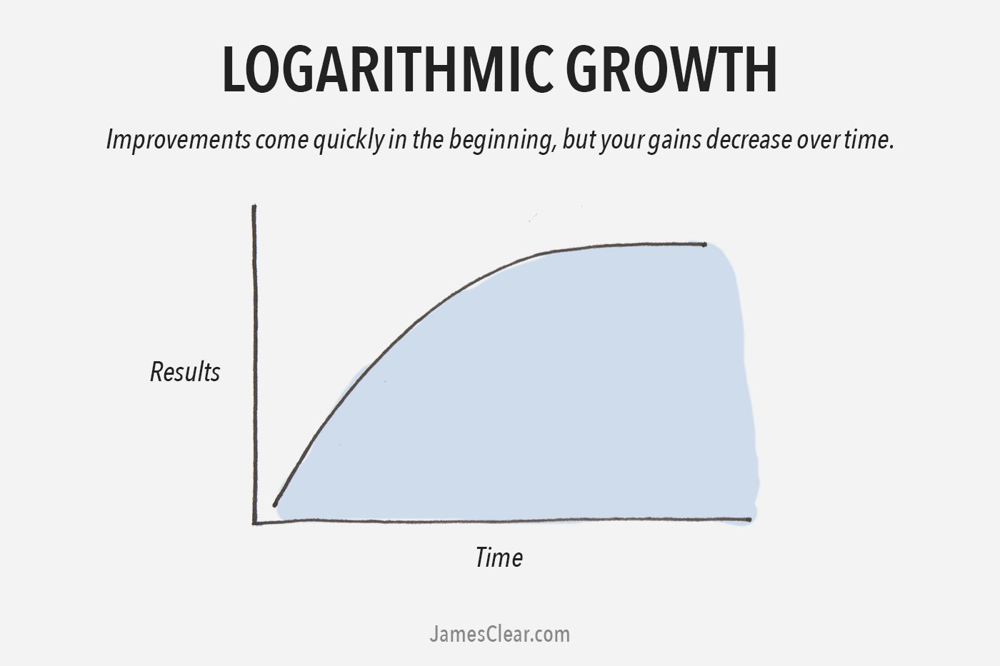

# Proposal
- Document notes about my learnings and experiences;
- Share knowledge with the community;
- Make it easier for me to write, find, and review notes; 
- Bit by bit, I'll translate and add old notes that I have kept in my Google Docs since September 2017.

# PostgreSQL
- PostgreSQL Data Types for Numbers
  - Integer Types
    - **`smallint`**
      - Stores small integers.
      - Range: -32,768 to 32,767.
    - **`integer` (or `int`)**
      - Default integer type.
      - Range: -2,147,483,648 to 2,147,483,647.
    - **`bigint`**
      - Stores large integers.
      - Range: -9,223,372,036,854,775,808 to 9,223,372,036,854,775,807.
  - Serial Types
    - **`smallserial`**
      - Auto-incrementing small integers.
      - Range: 1 to 32,767.
    - **`serial`**
      - Auto-incrementing standard integers.
      - Range: 1 to 2,147,483,647.
    - **`bigserial`**
      - Auto-incrementing large integers.
      - Range: 1 to 9,223,372,036,854,775,807.
  - Floating-Point Types
    - **`real`**
      - Single-precision floating-point number.
      - Approximate range: 6 decimal digits.
    - **`double precision`**
      - Double-precision floating-point number.
      - Approximate range: 15 decimal digits.
  - Numeric Types
    - **`numeric` (or `decimal`)**
      - Exact precision and scale.
      - Use for precise calculations, such as financial data.

# Programming
- In programming, speaking in english, what are the common ways to refer to `{` `[` `(`:
  - { } → Curly brackets, curly braces, or simply braces
  - [ ] → Square brackets
  - ( ) → Parentheses or round brackets
- Difference Between `float` and `double`
  - Precision
    - **`float`**: Single precision, accurate up to 7 significant digits.
    - **`double`**: Double precision, accurate up to 15-16 significant digits.
  - Memory Size
    - **`float`**: Occupies 4 bytes (32 bits).
    - **`double`**: Occupies 8 bytes (64 bits).
  - Value Range
    - **`float`**: ±1.5 × 10⁻⁴⁵ to ±3.4 × 10³⁸.
    - **`double`**: ±5.0 × 10⁻³²⁴ to ±1.7 × 10³⁰⁸.
  - Performance
    - **`float`**: Faster and consumes less memory, suitable for resource-constrained environments.
    - **`double`**: Slower but more precise, ideal for high-accuracy calculations.
  - Usage Scenarios
    - **`float`**: Use for applications where memory and speed are more critical than precision (e.g., graphics, embedded systems).
    - **`double`**: Use for applications requiring high precision (e.g., scientific or financial computations).

# Nest
- HTTPCode decorator and Httpstatus Enum
  - Instead of using
    ```js
      @ApiResponse({ status: 204 })
    ```
  - Use
    ```js
       @ApiNoContentResponse()
    ```
  - Why not use:
    ```js
    @HttpCode(HttpStatus.NO_CONTENT)
    ```
  - A method decorated with @Get, @Post etc. should specify the expected ApiResponse e.g. @ApiOkResponse(type: MyType). These decorators are in the @nestjs/swagger npm package.eslint@darraghor/nestjs-typed/api-method-should-specify-api-response

# Git
- bumping version of vulnerable libraries is a "build:" type commit?
  - Bumping the version of vulnerable libraries typically falls under the "chore:" type commit, not a "build:" commit. Here's how they generally differ:
  - **Chore:** This type is used for tasks that do not affect the application's functionality and do not modify production code. Updating dependencies, including bumping versions of vulnerable libraries, is usually categorized under "chore".
  - **Build:** This type is used for changes that affect the build system or external dependencies (e.g., npm, Gradle, Maven). While it might seem relevant, "build" is typically more related to changes in the tooling and configuration that are used to manage the build process itself, rather than updating dependencies due to vulnerabilities.
  - Therefore, it is more appropriate to use "chore:" when committing updates for fixing vulnerabilities in your dependencies.
- Which commit message pattern is correct?
  - `fix: Header on LDL Pause/Resume request`
  - `fix: Fix Header on LDL Pause/Resume request`
  - The first one, it's concise and avoids redundancy.
- Difference git config --local --global --system and no flag.
  - **`git config --system`**: Configures Git **system-wide** for all users on the computer. Requires admin/root access. Stores settings in `/etc/gitconfig`.
  - **`git config --global`**: Configures Git **globally** for the current user. No special permissions needed. Stores settings in `~/.gitconfig`.
  - Precedence: Local (--local) > Global (--global) > System (--system).
  - Without flag means global
  - **Precedence**: Local (`--local`) > Global (`--global`) > System (`--system`).

# Python
- What remember when using string interpolation on python?
  - You need to put a `f` before the string, outside the double quotes
  ```python
  print(f"Error: Skipping Sheet, Invalid format in file: {file_path}, sheet: {sheet_itle} (First column is not 'Country').")
  ```
  - Why `f`?
    - An f-string (short for formatted string literal) is a feature in Python that allows you to embed variables and expressions directly inside a string by prefixing the string with the letter `f` or `F`
- is there Null in Python?
  - No, Python does not have null like other languages such as JavaScript, Java, or C#. Instead, Python uses None to represent the absence of a value.
- This code will run properly?
  ```listToBeSorted.sort()```
  - No, because .sort() changes the array, but not return any value
  - What will be printed then?
    - It will be printed `None`
  - **What is `None` in Python?**
    - `None` represents the **absence of a value** or **a null value**.
    - It's a object belongs to the `NoneType` data type.
      - It's a unique object created with singleton
    - ✅ Use `None` when a variable has an **unknown or missing value**.
      - ✅ Use `is None` for comparison instead of `== None`.
        - Using == can produce false positives
    - `None` is **not** `0`, `False`, or an empty string (`""`).
    - ✅ Avoid using mutable default arguments like lists (`[]`) by using `None` as a default instead.
    - ✅ Use `None` when a variable has an **unknown or missing value**.
  ---
  - **Key Properties**
    - Functions return `None` by default if no return statement is provided.
    - `None` is often used to initialize variables with no value yet.
    - Checking `None` should be done using `is` instead of `==` (e.g., `if x is None:`).
  ---
  - **Common Use Cases**
    - **Default Return Value in Functions**: Functions return `None` if they don’t explicitly return anything.
    - **Placeholder for Missing Values**: Used to indicate that a variable has no assigned value yet.
    - **Avoiding Mutable Default Arguments**: Prevents unintended mutations in functions.
    - **Optional Function Arguments**: Used to set default values when no argument is provided.
  ---  
- **Setting up environment**
  - First install venv, to create a exclusive virtual environment for yout project
    - Doing that, we avoid conflict on multiple libs and versions
  - Go to your project folder
  - To create the virtual environment
    - python3 -m venv your_project_name
  - To activate the virtual environment
    - source your_project_name/bin/activate
  - Install the libs you want, for example:
    - pip install pyautogui
  - Verifiy the libs installation
    - pip show pyautogui
  - Deactivate virtual environment
    - deactivate
  - To create a dependencies file
    - pip freeze > requirements.txt
  - Create a .gitignore to not commit dependencies
    ```
    #Ignore virtual environment directory
    your_project_name/

    #Python bytecode files
    *.pyc

    #IDE settings (for Visual Studio Code, for example)
    .vscode/
    ```
  - Commit all on git
  - Next time someone clone your project, the'll need to do:
    - Activate Virtual Environment
        - source your_project_name/bin/activate
        - Install dependencies (only first time)
            - pip install -r requirements.txt
            - Verifiy the instalation
                - pip list
    - Run
        - python main_project_name.py
- pyautogui
  - Python Library to do actions like cliking and typing
  - Getting coordinates to click
    ```python
    import pyautogui
    import time

    try:
        while True:
            x, y = pyautogui.position()
            print(f"Mouse position: (x:{x}, y:{y})")
            time.sleep(1)
            print("Press Ctrl+C to stop.")
    except KeyboardInterrupt:
        print("\nTracking stopped.")
    ```
  - Mouse click
    - pyautogui.click(x=x1, y=y1)
- Sleep
  ```python
  import time
  time.sleep(5)
  ```
  - The parameter is in seconds
  - Usually on another modern languages the time is in milliseconds
- Identation rules which code is inside a function, for example.
- Function
    ```python
    def myFunction:
      print("Hello World!")
    ```
  - Not necessary open or close curly braces.
  - Not necessary use semicolon in the end of line
  - Necessary the keyword `def` to define a function 
  - Necessary the `two dots` after function name
- For
  ```python
  for num in nums:
        print(num)
  ```
  - Similar to `for in` of javascript
  - But there is no `for of` to iterate indexes
  - To do it, it's necessary range(len(my_array)) or enumerate()
    - Use enumerate() if you need both index and value.
    - Use range(len(array)) only if you need the index and not the value.
    - The performance difference is almost nothing.
  - len()
    - returns the array size
    - it's a function and you need to pass the array as parameter
      - len(my_array)
    - In javascript was different, because it's a property from Array type
      - myArray.length
  - range()
    - function generates a sequence of numbers and is commonly used in loops.
    - range(start, stop, step)
      - start: Starting number (default: 0).
      - stop: Ending number (exclusive, required).
      - step: Increment or decrement (default: 1).
      - It’s memory-efficient because it doesn’t create a list unless explicitly converted with list(range(...))
  - enumerate()
    - The enumerate() function in Python allows you to iterate over an iterable and get both the index and the value of each element.
    - enumerate(iterable, start=0)
    - iterable: The sequence to iterate over.
    - start: The starting index (default is 0).
    ```python
    my_list = ['a', 'b', 'c']
    for index, value in enumerate(my_list):
    print(f"Index: {index}, Value: {value}")
    ```
- Naming functions and array?
  - Python naming conventions (PEP 8):
    - Variables/Functions: snake_case
    - Classes: PascalCase
    - Constants: UPPERCASE
    - Private variables/methods: _single_underscore, __double_underscore
    - Modules/Packages: lowercase_with_underscores
    - Magic methods: __method_name__
      - Example: __init__(), __str__()
- print()
  - It's a function similar to System.out.println() from Java
  - It's a function, remember to use parenthesis
- Traverse dictionary?
  ```python
  for key in my_dict:
    print(key)

  for value in my_dict.values():
    print(value)

  for key, value in my_dict.items():
    print(key, value)
  ```
- Queue
  - Use queue.Queue() for multithreading.
  ```python
  import queue
  q = queue.Queue()  #Create a queue
  q.put(1)  #Add elements
  q.put(2)
  q.put(3)
  print(q.get())  #Remove and return the first element (FIFO)
  print(q.get())
  print(q.get())
  print(q.empty())  #Check if the queue is empty
  ```
  - Use collections.deque() for fast performance in single-threaded applications.
  ```python
  from collections import deque
  q = deque()  #Create a queue
  q.append(1)  #Add elements
  q.append(2)
  q.append(3)
  print(q.popleft())  #Remove and return the first element (FIFO)
  print(q.popleft())
  print(q.popleft())
  print(len(q) == 0)  #Check if the queue is empty
  ```
  - Avoid using lists unless you have very small data.
  ```python
  q = []
  q.append(1)  #Add elements
  q.append(2)
  q.append(3)
  print(q.pop(0))  #Remove the first element (FIFO)
  print(q.pop(0))
  print(q.pop(0))
  print(len(q) == 0)  #Check if the queue is empty
  ```
- Increment Operator
  - In Python, the ++ (increment operator) from languages like C++ or Java does not exist. Instead, you need to use += 1.
  ```python
  sum = 0
  sum += 1  #Equivalent to sum++
  sum += 1  #Increment again

  print(sum)  #Output: 2
  ```
- **List (Dynamic Array)**
```python
lst = [1, 2, 3, 4]
#Iterating over values
for item in lst:
    print(item)
#Iterate over indexes and values
for index, value in enumerate(lst):
  print(f"Index {index}: Value {value}")
```
  - Operations with List
    - Access (Indexing) | `lst[i]`
    - Access last index | `lst[-1]` 
    - Reverse           | `lst.reverse()`
    - Append            | `lst.append(x)`    
    - Insert at i       | `lst.insert(i, x)`
    - Remove by index   | `del lst[i]`      
    - Remove by value   | `lst.remove(x)`
      - Remove only first value occurence
      - To remove all, use for or list comprehension
    - Pop from end      | `lst.pop()`        
    - Pop from i        | `lst.pop(i)`       
    - Search (Linear)   | `x in lst`         
    - Sort              | `lst.sort()`
      - It can handle decimal and negative values   
    - Merge
    - Find index
    - Value exists?

-  **Set (Unordered Collection of Unique Elements)**
```python
  s = {1, 2, 3}
```
  - Declare with `{}` instead `[]`
  - Add Element     | `s.add(x)`       
  - Remove Element  | `s.remove(x)`    
  - Check Existence | `x in s`         
  - Union           | `s1 | s2`        
  - Intersection    | `s1 & s2`        
  - Difference      | `s1 - s2`        
- **Dictionary (Hash Table)**
```python
d = {'a': 1, 'b': 2, 'c': 3}
d['d'] = 4 
#Iterating over keys (default)
for key in d:
    print(key, d[key])
#Iterating over values
for value in d.values():
    print(value)
#Iterating over key-value pairs
for key, value in d.items():
    print(f"Key: {key}, Value: {value}")
```
  - Insert       | `d[k] = v`       
  - Update       | `d[k] = new_v`   
  - Lookup       | `d[k]`           
  - Remove       | `del d[k]`       
  - Exisits      | `k in d`         
  - Iterate Keys | `for k in d`     
- **Deque (Double-Ended Queue)**
```python
dq = deque([1, 2, 3])
#Simple for-loop
for item in dq:
    print(item)
#Iterating in reverse
for item in reversed(dq):
    print(item)
```
  - Append Right  | `dq.append(x)`    
  - Append Left   | `dq.appendleft(x)`
  - Pop Right     | `dq.pop()`        
  - Pop Left      | `dq.popleft()`    
  
# Linux / Ubuntu
- Issue with session keyring on Ubuntu using biometrics
  - Without using a password, I used biometrics, and then it asked for a password to unlock the session keyring, which is annoying.
  - One solution is not to shut down the computer, so I only need to enter the password the first time I boot up.
  - When locking the screen again, it can be unlocked with biometrics, and it won’t ask for the session keyring again.
  - From time to time, it is recommended to shut down the computer. I feel it starts getting a bit slow sometimes, maybe due to too much data in the cache and RAM.
- What means the command pwd?
  - The pwd command in Linux stands for Print Working Directory. It displays the full absolute path of the current directory you are in.
- What is the environment variable `$HOME`?
  - In Ubuntu (and other Linux distributions), `$HOME` is an environment variable that represents the home directory of the currently logged-in user.
  - If your username is lucas, then your home directory is typically:
  - `/home/lucas`
  - When you use `$HOME`, it expands to this path:
  ```shellscript
    $ echo $HOME
    /home/lucas
  ```
  - Why is $HOME useful?
    - It provides a shortcut to access your home directory.
    - Many programs use it to store configuration files (e.g., .bashrc, .ssh/, .config/).
    - You can use it in scripts to refer to your home directory dynamically.
- What is `~` in Linux?
  - In Linux, ~ (tilde) is a shorthand for the home directory of the currently logged-in user. It works similarly to $HOME.
  ```bash
    echo ~
    /home/lucas
  ```
- What's the Difference Between `sudo` and `root` in Linux?
  - `root`  
    - The **root user** is the **superuser** in Linux.  
      - Has **full control** over the system.  
      - Can modify, delete, or access any file.  
      - Can manage users, permissions, and install/remove software.  
  -  `sudo`  
    - `sudo` (**Superuser Do**) allows a regular user to execute commands as **root**.  
      - Temporarily grants **admin privileges** to a user.  
      - Requires authentication (usually the user's password).  
      - Uses `/etc/sudoers` to define which users can run which commands.  

  - Key Differences  
    | Feature   | `root` | `sudo` |
    |-----------|--------|--------|
    | Access Level | Full system control | Temporary elevated privileges |
    | Authentication | Direct login (or `su` command) | Requires password (configurable) |
    | Security | High risk (permanent superuser) | More secure (temporary access) |
    | Usage | Used for administrative tasks | Recommended for safe privilege escalation |
  - Example Commands  
    - **Switch to root user:**  
      ```bash
      su -
      ```
    - **Run a command as root using sudo:**  
      ```bash
      sudo apt update
      ```
- What is `top` Command in Linux?
  - The `top` command is a system monitoring tool that displays real-time information about system processes, CPU usage, memory usage, and more. It provides an overview of system performance and resource consumption.
  - Key Information Displayed by `top`
    1. **System Uptime** – How long the system has been running.
    2. **Load Average** – The average system load over the last 1, 5, and 15 minutes.
    3. **CPU Usage** – The percentage of CPU time used by user processes, system processes, and idle time.
    4. **Memory Usage** – Total, used, and available RAM and swap space.
    5. **Processes List** – A dynamic list of running processes, showing details like:
      - **PID** (Process ID)
      - **User** running the process
      - **CPU and Memory usage**
      - **Command** that started the process
  - Useful Commands Inside `top`
    - Press `q` → Quit `top`
    - Press `k` → Kill a process (you’ll need to enter the PID)
    - Press `M` → Sort processes by **memory usage**
    - Press `P` → Sort processes by **CPU usage**
  - For an alternative with a more user-friendly interface, you can use `htop`
  - The top command in Linux is called "top" because it displays the top (most resource-intensive) processes running on the system.
  - When you run top, it continuously updates and shows the most CPU- and memory-consuming processes at the top of the list by default. The name reflects its primary function: monitoring the top processes affecting system performance.
- How filter `top` by memory usage
  - Run `top`
  - Once you're on top table
  - Press Shift + M (uppercase M) to sort processes by memory usage.

# DBeaver
- FATAL: too many connections for role "my.username"
  - It was opening a separate connection to fetch the metadata from the database, such as tables and columns.
  - And the server was configured to allow only 1 connection per user
  - To fix that it's necessary to unable open a second connection to download metadata. For me only worked if I changed in 2 places:
    - Right bottom connection > Edit Connection > Metadata > Open separate Connection to Download Metadata > Never
    - Menu > SWLEditor > Open separate Connection to download Metadata > Never
  - The DBeaver version was 23.34
  - Changing only in 1 place, it didn't work.
  - 
  - 

# Shell script
- Bash String Comparison Issue with Time (`HH:MM`)  
- **Question:** Why does the following Bash script not work as expected?  
  ```bash
  hourMinute="00:01"
  if [[ "$hourMinute" >= "00:00" && "$hourMinute" < "18:30" ]]; then
    hourMinute="18:35"
  fi
  echo $hourMinute
  ```
  - Bash performs **lexicographical string comparison**, which does not work correctly for time values in `HH:MM` format. The colon (`:`) in `"HH:MM"` can cause unexpected results in comparisons.  
  - Using only `>` instead `>=` it will work?
    - No, the fundamental problem remains: Bash performs lexicographical string comparisons when using
  - What is lexicographical string comparison?
    - Lexicographical string comparison is a way of comparing strings **character by character**, based on their ASCII values, just like words are ordered in a dictionary.  
    - **How Does It Work?**
    - It compares characters from **left to right**.
    - If two strings have different characters at any position, the comparison stops there.
    - The order follows the **ASCII table**, where:
      - `"0"` (ASCII 48) < `"1"` (ASCII 49) < `"2"` (ASCII 50) ...  
      - `"9"` (ASCII 57) < `":"` (ASCII 58) < `"A"` (ASCII 65)  
      - Lowercase letters (`"a"` - `"z"`) have higher values than uppercase (`"A"` - `"Z"`).  

    - **Examples in Bash**
    ```bash
    [[ "apple" < "banana" ]]  #True (Because 'a' < 'b')
    [[ "car" > "banana" ]]    #True (Because 'c' > 'b')
    [[ "12:30" < "18:30" ]]   #Unexpected! ':' (ASCII 58) affects comparison
    ```
    - **Problem with `HH:MM` Time Comparison**
    - Since `:` (ASCII 58) comes **before** numbers (`0-9`), it can lead to **incorrect results**:
    ```bash
    [[ "2:00" > "12:00" ]]  #False (because '2' comes before '1' in ASCII order!)
    ```
    - Even though **2:00 is later than 12:00**, lexicographical comparison treats it as smaller.
    - **Solution: Convert to Numbers**
    - To compare times correctly in Bash, convert `"HH:MM"` into total **minutes**:
    ```bash
    timeToMinutes() {
      IFS=":" read -r h m <<< "$1"
      echo $((10#$h * 60 + 10#$m))
    }
    if (( $(timeToMinutes "12:30") < $(timeToMinutes "18:30") )); then
      echo "Correct comparison!"
    fi
    ```
  - Fix: Convert Time to Minutes  
  - **Solution:** Convert `HH:MM` into total minutes and compare numerically.  
  ```bash
  hourMinute="00:01"
  ```
  - Function to convert HH:MM to total minutes
  ```bash
  timeToMinutes() {
    IFS=":" read -r h m <<< "$1"
    echo $((10#$h * 60 + 10#$m))
  }
  ```
  - Reference times in minutes
  currentMinutes=$(timeToMinutes "$hourMinute")
  minLimit=$(timeToMinutes "00:00")
  maxLimit=$(timeToMinutes "18:30")
  ```bash
  if (( currentMinutes >= minLimit && currentMinutes < maxLimit )); then
    hourMinute="18:35"
  fi
  echo "$hourMinute"
  ```
  - **Explanation:**  
  - The function `timeToMinutes` converts `"HH:MM"` into total minutes (`HH * 60 + MM`).  
  - `10#$h` ensures leading zeros are handled correctly (avoiding octal interpretation).  
  - Numeric comparison now works correctly.  

- Some `space` problems I had
  - Spaces kinda define how the code run, like Python for example
  - Declaring variable
    - `local my_variable = "someVale"`
      -  This will not run right, because the variable and value should't have space between
      - Fixed: `local my_variable="someVale"`
        - Yeah, I know, wtf
  - Declaring if
    - ``if [ -z "$my_variable"]; then``
    - This is will not run right, because after and before braces, you need spaces
      - Fixed: ``if [ -z "$my_variable" ]; then``
        - I give up complaining
- If statement
  ```shell
  if [ -z "$my_variable" ]; then
    echo "My variable is empty"
    exit 1;
  fi
  ```
  - You don't open with a curly braces
    - you open with semicolon + then
  - The syntax is very different from modern languages
  - The parenthesis is replaced by square brackets
  - It's necessary finalize the first line of if statement with
    - semicolon
    - then
  - You don't close with curly braces
    - You close with fi
- -z Flag
  ```shell
  if [ -z "$my_variable" ]; then
    echo "My variable is empty"
    exit 1;
  fi
  ```
  - [ -z "$commit_info" ]: This is a test command that checks if the length of the string stored in commit_info is zero (i.e., if it is empty).
  - -z: This flag checks if the string is of zero length.
  - "$my_variable": This is the variable being checked. The double quotes around the variable ensure that it is treated as a single string, even if it contains spaces or is empty.
- Difference between exit and return
  - Both will stop the execution of script below, but exit will close the terminal too and return not.
  - exit
    - Purpose: Terminates the entire shell script or the current shell session.
    - Scope: Affects the script or shell itself.
    - Exit Code: Sets the exit status (a numerical value) for the script, which can be checked by the calling process.
    - Use Case: Used when you want to stop the execution of the script completely, optionally returning an exit status to the parent process.
    - Example:
      ```bash
      echo "This will print"
      exit 1
      echo "This will not print"
      Output: This will print
      The script ends with an exit code of 1.
      ```
  - return
  - Purpose: Terminates the execution of a function within a shell script and optionally returns a status code to the calling context (inside the script).
  - Scope: Affects only the current function and returns control back to the script.
  - Exit Code: Sets the function's return value, which can be checked by the script using $?.
  - Use Case: Used within functions to indicate their success or failure to the caller.
  - Example:
  ```bash
    my_function() {
        echo "Inside function"
        return 2
        echo "This will not print"
    }
    my_function
    echo "Function returned with status $?"
    ```
  - Output:
    ```
    Inside function
    Function returned with status 2
    ```
# Prompts
- To install tools:
  - Turn on the internet search
  - Search for the most current and recommended way to install $your_tool on ubuntu according to the official documentation
    - This prompt avoid using old intallations way, which can cause troubles after.
    - You always can go to the official documentation, which is the recomended ...
- To summarize and format notes in GPT chats
  - resuma todas as perguntas e respostas em inglês e formate em markdown em tópicos utilizando `-`.
  - summarize all questions and answers in English and format in markdown in topics using `-`.


# Software Development
- DLT and DLQ
  - DLT = Dead Letter Topic
  - Similar to DLQ (Dead Letter Queue) but used in topic-based messaging systems
  - Stores messages that failed to be processed
  - Common in systems like Apache Kafka
  - Essential for error handling in distributed systems
- By generating a random UUID like this, can we not randomly overwrite any data that already has that ID?
  - Yes, a randomly generated UUID **could** collide with an existing one, but the probability is extremely low. UUID v4 has **122 bits of entropy**, resulting in **2¹²² possible values**.  
  - Collision Probability  
  - Even if you generate **1 billion UUIDs per second** for **100 years**, the chance of a collision remains below **50%** (based on the birthday paradox).  
  - Avoiding Collisions  
  - 1. **Check the database** before saving a new UUID.  
  - 2. **Use UUID v1** (timestamp + MAC address) for globally unique IDs.  
  - 3. **Combine UUID with another identifier**, like a namespace.  
  - In practice, the risk is so low that most systems don’t worry about it. UUIDs are widely used in databases without issues.
- Which protocol rest and graphql use?
  - Both **REST** and **GraphQL** use **HTTP (Hypertext Transfer Protocol)** as their underlying protocol for communication between clients and servers.  
  - **REST** typically follows standard HTTP methods like `GET`, `POST`, `PUT`, `DELETE`, and `PATCH` to perform CRUD (Create, Read, Update, Delete) operations. It relies on URLs to represent resources and uses headers and status codes for communication.  
  - **GraphQL**, on the other hand, usually uses HTTP `POST` requests (though `GET` can be used for queries) to send a structured query to a single endpoint, allowing clients to request exactly the data they need.  
  - Both can also be used over **WebSockets** for real-time updates, but HTTP remains the primary transport protocol.
-  HTTP
  - **Body**: The entire content sent in a message, such as an HTTP request.  
  - **Payload**: Only the useful and relevant data within the body that will be processed by the application.
  - **Example**: The body includes metadata and data, while the payload is just the useful content (the data).
  ```json
  {
    "metadata": {
      "timestamp": "2025-01-14T10:00:00Z"
    },
    "data": {
      "name": "Lucas",
      "email": "lucas@example.com"
    }
  }
  ```

# English for Brazilians / Grammar
- NIT (nitpicking)
giving too much attention to details that are not important, especially as a way of criticizing:
If you spent less time nitpicking, you'd get more work done.
- What's the difference between a sentence and a phrase?
  - Phrase
    - Group of words forming a grammatical unit
    - Lacks either subject or predicate (or both)
    - Does not express a complete thought
    - Cannot stand alone
    - No specific punctuation requirements
    - Examples: "in the garden," "running quickly"
  - Sentence:
    - Contains both subject and predicate (verb)
    - Expresses a complete thought
    - Can stand alone as a complete unit of communication
    - Begins with capital letter and ends with punctuation
    - Examples: "She walked in the garden," "The man was running quickly"
- Comprehension
  - Kinda differente than the portuguese word
  - Easier to memorize
    - Compre / Hension
    - Without two `e` like in portuguese
- Verbo pertencer
  - Which topic of software development this questions belongs.
    - `Belongs` o verbo `Pertencer`
  - A pergunta certa seria com `what` ou `which`?
    - "Which" é mais adequado quando você está selecionando de um conjunto determinado, enquanto "what" seria mais aberto e genérico.
- Difference of meaning and sound, for throught and similar words:

| Palavra     | Som Aproximado | Significado |
|------------|---------------|-------------|
| **THROUGH** | *THRU* (*drive-thru*) | Através de algo |
| **THROUGHOUT** | *thru-ÁUT* (rima com *knock-out*) | Durante todo / Por toda parte |
| **THOROUGH** | *THÂ-RÔU* (*sarro* com *th*) | Completo, detalhado |
| **THOUGHT** | *THÓT* (*robot*) | Pensamento / Pensou |
| **THOUGH** | *DÔU* (*dou* com *th*) | Embora / Porém |
| **TOUGH** | *TÂF* (*stuff*) | Difícil / Resistente |

Which sentence is correct and why?  
  - **"My conclusion was that the log had been deleted."**  
  - **"My conclusion was that the log has been deleted."**  
  - ✅ **"My conclusion was that the log had been deleted."** → Correct because *past perfect* (*had been deleted*) indicates the deletion happened before the past conclusion.  
  - ❌ **"My conclusion was that the log has been deleted."** → Incorrect because it mixes past ("My conclusion was") with *present perfect* ("has been deleted"), creating a temporal inconsistency.  
  - 💡 If the conclusion is still valid in the present, use:  
    - 👉 **"My conclusion is that the log has been deleted."**  

- Milissegundos
  - milliseconds
    - A common brazilian mistake is write this word with only one L
  - Sim em português é com dois S, se não o som seria milizegundos
- Objetivamente
  - A forma de correta de escrever e `objectively`
  - Tava com dificuldade de escrever essa palavra, tentava algo como `objectvly`
    - Acredito que pela sonoridade
- Afim de
  - `In order to`
    - I studied hard in order to pass the exam.
  - Normalmente pode ser substituído por `to`, porém fica com menos ênfase e mais casual
    - I studied hard to pass the exam.
- Quando usar **may, should, could e must** e suas diferenças:  
    - **May**: Permissão ou possibilidade. Ex.: *It may rain later.*  
    - **Should**: Conselho ou expectativa. Ex.: *You should eat healthier.*  
    - **Could**: Possibilidade, habilidade passada ou pedido educado. Ex.: *Could you help me?*  
    - **Must**: Obrigação ou alta certeza. Ex.: *You must wear a seatbelt.* / *He must be at home.*
- O que significa numb?
    - "entorpecer", "anestesiar" ou "amortecer", dependendo do contexto.
        - Entorpecer
            - produzir torpor em (alguém ou a si mesmo); estar ou ficar em estado de torpor.
                - sentimento de mal-estar caracterizado pela diminuição da sensibilidade e do movimento; entorpecimento, estupor, insensibilidade.
                - indiferença ou apatia moral; indolência, prostração.
    - Pode singifica "indiferença" também, como na música do Linkin Park
        - "I've become so numb, I can't feel you there"
        - Become so tired, so much more aware
            - aware é consciente
            - self-awareness
                - autoconsciência
                - your ability to perceive and understand the things that make you who you are as an individual, including your personality, actions, values, beliefs, emotions, and thoughts  
    - Físico: "My fingers are numb from the cold."
        - (Meus dedos estão dormentes por causa do frio.)
    - Emocional: "She felt numb after the bad news."
        - (Ela se sentiu entorpecida após a má notícia.)
    - Time may numb the pain.
        - O tempo pode diminuir a dor
            - Diminuir no sentido de amortecer

# Agile
- The article *"Effort and Complexity: When Size Really Matters"* discusses the challenges of estimation in agile teams, emphasizing the importance of considering both effort and complexity when estimating tasks.  
- The author proposes a five-level scale for each of these factors:  
  - **Effort:**  
    - **Level 1:** Minimal effort, completed in a few hours.  
    - **Level 2:** Requires one or two days of work.  
    - **Level 3:** Moderate effort, between three to five days.  
    - **Level 4:** Large task, possibly more than a week; a candidate for splitting.  
    - **Level 5:** Extremely large, difficult to estimate; should be broken down into smaller parts.  
  - **Complexity:**  
    - **Level 1:** No technical or business unknowns; skills are present in the team.  
    - **Level 2:** Few unknowns, with no significant risks.  
    - **Level 3:** Dependencies on other tasks or systems; may require additional study.  
    - **Level 4:** Increased dependencies and difficulty in description; requires experienced professionals.  
    - **Level 5:** Highly complex, with many dependencies and unknowns; needs in-depth alignment.  

- The intersection of these levels results in a risk matrix that helps the team assess the feasibility of completing a task within a sprint. Tasks with high levels of effort and complexity pose greater risks and may need to be better understood or broken down.
- 
- The author suggests that teams define working agreements to determine an acceptable level of risk and use visual tools, such as the risk matrix, to monitor and plan tasks more effectively.  
- ([agilemomentum.wordpress.com](https://agilemomentum.wordpress.com/2018/02/18/esforco-e-complexidade-quando-tamanho-realmente-importa/?utm_source=chatgpt.com))  

# VSCode
- Search using Regular Expressions
  - 
  - `#.*Ubuntu`
    - In this case I'm filtering lines started with `#`
      - In Markdown, `#` it's used for Titles
    - `.*`
      - This is a regular expression
      - `.` whatever character
      - `*` one or many times
    - Word Ubuntu
  - So in this search, I'm filtering lines 
    - started with `#`
    - With whataver characters many times
    - Finishing with the word `Ubuntu`
  - If I tried searching for `# Ubuntu`, I'll find nothing, because the line is
    - `# Linux / Ubuntu`
- How put multicursor clicking?
  - Alt + Shift + Clicks
- How put multicursor searching
  - Select occurence
  - Ctrl + Shift + L

# Github Copilot
- How install on VSCode?
  - **Installation**: Just install the extension in VS Code.  
  - **Login**: A tooltip will appear to log in. Log in with the account that has Copilot access.  
  - **Inline Suggestions**:  
    - Press `Ctrl + I` to ask something inline.  
    - Start typing code or a comment, and a suggestion will appear. Press `Tab` to accept it.  
    - Navigate through autocomplete options using `Ctrl + [`.  
  - **Copilot Chat**:  
    - Open a chat with Copilot using `Ctrl + Alt + I` or `Ctrl + Shift + I`.  
  - **Context Awareness**: Copilot understands context, so when you refer to a specific file, it knows which one you're talking about.

# Maven
- What should pay attention after updating vulnerable transitive dependecy?
  - **Check for Hardcoded Versions**: Before updating a vulnerable transitive dependency, verify if its parent dependency has a hardcoded version in the code.  
  - **Issue Encountered**: Updating the transitive dependency to a newer version didn't work because the parent dependency was locked to an older version.  
  - **Unexpected Behavior**: Even though the dependency tree showed the parent package pointing to the new version, the vulnerable transitive dependency was still being pulled.  
  - **Lesson Learned**: Always check if the parent dependency enforces a specific version, as this can prevent updates to transitive dependencies.
 
# Devops
- **Difference between DNS and Domain**:  
  - Domain refers to the website itself, e.g., google.com, wikipedia.org, amazon.com.  
  - DNS (Domain Name System) is a distributed hierarchical system responsible for assigning readable names to server IPs that host websites.  

- **What does DNS stand for?**  
  - DNS stands for "Domain Name System" in English or "Sistema de Nomes de Domínio" in Portuguese.  
  - The DNS is a distributed hierarchical system responsible for translating human-readable domain names, like "example.com", into IP addresses, which are used by computers to communicate over the internet.  
  - Essentially, DNS helps find the IP address associated with a specific domain name, enabling users to access websites and online services.  
  - In simple terms, DNS is like an "Internet phonebook", allowing computers to locate online resources using domain names such as "google.com" or "facebook.com".
- Is MAC Adress fix?
  - Yes, the MAC address (Media Access Control address) is generally fixed. It is a unique identifier assigned to a network interface controller (NIC) for communication on a physical network. The MAC address is typically assigned by the manufacturer of the hardware and is burned into the device's firmware.
  - However, it is possible to change the MAC address temporarily through software, but this is often done for privacy or troubleshooting purposes, and it doesn't alter the original MAC address stored in the device.
- Is MAC Adress unique in world?
  - Yes, the MAC address is intended to be unique worldwide. The first half of the MAC address is assigned to the manufacturer by the IEEE (Institute of Electrical and Electronics Engineers) and is known as the Organizationally Unique Identifier (OUI). The second half of the MAC address is typically generated by the manufacturer and is intended to be unique to each device.
  - However, while the goal is for each MAC address to be globally unique, there have been rare cases where manufacturers may accidentally assign duplicate MAC addresses, leading to conflicts. Still, these occurrences are quite unusual, and the system is designed to minimize such issues.
  - It is possible to change the MAC address temporarily through software, but this is often done for privacy or troubleshooting purposes, and it doesn't alter the original MAC address stored in the device.
- is MAC Address fakeable?
  - Yes, the MAC address can be faked or spoofed. It's possible to change the MAC address temporarily using software tools or by adjusting network settings. Many devices, such as computers and smartphones, allow users to change the MAC address of their network interfaces for various reasons, such as:
  - **Privacy**: To hide the real MAC address from networks or tracking systems.
  - **Network Troubleshooting**: To bypass MAC address filters or resolve network issues.
  - **Security**: To avoid tracking or limit the ability of certain services to link devices through their MAC address.
  - While spoofing a MAC address is possible, it's important to note that it doesn't affect the physical hardware or the actual factory-assigned MAC address. The new address is only temporary and used for the duration of the network session or until the device is reset.

  # Java / Kotlin
- **The compiler obligate to treat `RuntimeException`?**  
  - Unlike checked exceptions, the compiler does not require handling it.  
- **If a checked exception occurs and is not caught, does execution stop?**  
  - Yes, if a checked exception is not caught, the program stops.  
  - If not handled with `try-catch` or declared with `throws`, the code won't even compile.  
- **If a `RuntimeException` occurs, does execution continue to the next line?**  
  - No, execution stops immediately if a `RuntimeException` is not caught.  
  - The exception propagates up the call stack and can terminate the program.  
- **If a `NullPointerException` occurs, does execution stop?**  
  - Yes, `NullPointerException` is a `RuntimeException` and will halt execution if not caught.  
  - Any code after the exception won't execute unless handled with `try-catch`.  
- **If `RuntimeException` also stops execution, why is its handling not mandatory?**  
  - `RuntimeException` represents programming errors that should be **prevented**, not necessarily handled.  
  - Mandatory handling would clutter the code and hide bugs.  
  - Instead of catching `NullPointerException`, it's better to ensure the object is initialized before use.  
  - Catching `RuntimeException` is useful for logging errors or preventing application crashes.
- **How to write null-safe code in Java?**  
  - **Use `Objects.requireNonNull`** to validate parameters.  
  - **Check for `null` before accessing objects** (or use `Optional`).  
  - **Prefer `Optional` over returning `null`** to avoid explicit checks.  
  - **Initialize variables properly** to avoid uninitialized fields.
    ```java
    private List<String> names = new ArrayList<>(); // Avoids null
    ```
  - **Use annotations like `@NonNull`** (from Lombok or Spring).  
  - **Return empty collections instead of `null`** to prevent unnecessary null checks.  
  - **Use safe chaining with `Optional`** to avoid deep nested null checks.
    - Instead of:
    ```java
      String country = user != null && user.getAddress() != null ? user.getAddress().getCountry() : "Unknown";
    ```
    - Use Optional:
    ```java
    String country = Optional.ofNullable(user)
    .map(User::getAddress)
    .map(Address::getCountry)
    .orElse("Unknown");
    ```
- Take care with dumb Null Pointer Exceptions
  - I saw this code
  ```java 
  obj.equals(null)
  ```
  - That's wrong, because if obj is null, you'll get a Null Pointer for sure
  - The correct way is use Optional for null safety or obj == null
  - Another weird way, but it works: NULL.equals(obj)

---

# Kafka
- **What is Kafka?**
  - Apache Kafka is a distributed streaming platform designed to handle large volumes of real-time data.
  - It is widely used for building data pipelines, messaging systems, and real-time analytics applications.
  - Originally developed by LinkedIn, Kafka is now maintained by the Apache Software Foundation.

- **Benefits of Kafka:**
  - Decouples consumers and producers, enhancing flexibility in communication.
  - Improves performance by reducing CPU and RAM spikes.
  - Guarantees request processing.
  - If a service is unavailable, messages remain in Kafka and can be consumed once the service is back online.
  - Microservices architecture reduces the learning curve and makes project updates easier.
  - Easier to update the project, such as fixing vulnerable libraries.
  - Using messaging services like Kafka reduces project coupling.
  - Communication is asynchronous, so we don’t need to wait for responses, removing blocking times and allowing more requests to be processed per second.

- Concepts
  - **Producers**
    - Produce messages in Kafka.
  - **Consumers**
    - Consume messages, which are written to topics.
  - **Topics**
    - Contain messages and are divided into partitions.
  - **Clusters**
    - Composed of brokers and nodes.
  - **Brokers**
    - Kafka servers responsible for storing and distributing messages.
  - **Nodes**
    - Individual Kafka servers in a cluster.
  - **Messages**
    - Default expiration is 7 days, but this can be configured.
    - Messages can be located using two data points.
  - **Partition**
    - A division within a topic where messages are stored.
    - Offsets represent the position of messages within a partition.
    - A message can be replicated across multiple partitions, allowing multiple consumers to process them simultaneously, increasing throughput.
  - **Throughput**
    - The amount of data the system can process within a given period of time.
    - Also referred to as transfer rate or performance.
  - **ZooKeeper**
    - A centralized and distributed service used to manage configuration, synchronization, and coordination in distributed systems.
  - Visual Explanations
    - 
    - 

# LeetCode
- Binary Search
  - Efficient search in sorted arrays, **O(log n)**.
  
  - REMEMBER: The array should be sorted, to use Binary Search.
    - REMEMBER 2: If you use a native sort function, it will be a performance cost doing that, depending the array size.
    - I think it's better to use binary search, if the array is already sorted.
    - Maybe some cases it will be valid, sorte and the use binary search, but only real scenario metric can say that.
  - The idea is to repeatedly divide the list in half and compare the target value to the middle element. Depending on the comparison result, you either:
    - Narrow down the search to the left half.
    - Narrow down the search to the right half.
  - Binary Search Algorithm:
  1. Start with the entire list.
  2. Find the middle element.
  3. If the middle element is equal to the target, return the index.
  4. If the target is less than the middle element, repeat the search on the left half.
  5. If the target is greater, repeat the search on the right half.
  6. If the search range becomes empty, the target is not in the list.
```python
def binary_search(arr, target):
    left, right = 0, len(arr) - 1  # Step 1: Set the search boundaries

    while left <= right:  # Step 2: Continue while there is a search range
        mid = left + (right - left) // 2  # Step 3: Find the middle index
        mid_value = arr[mid]  # Get the value at the middle index
        
        print(f"Searching between indexes {left} and {right}. Middle index: {mid}, Value: {mid_value}")

        if mid_value == target:  # Step 4: Check if the middle value is the target
            return mid
        elif mid_value < target:  # Step 5: Narrow down to the right half
            left = mid + 1
        else:  # Step 6: Narrow down to the left half
            right = mid - 1
            
    return -1  # Target not found

# Example usage:
arr = [1, 3, 5, 7, 9, 11, 13, 15, 17, 19]
target = 7
index = binary_search(arr, target)

if index != -1:
    print(f"Element found at index: {index}")
else:
    print("Element not found")
```
  - Why Use Binary Search?
  - **Efficiency:** O(log n) time complexity, much faster than linear search O(n).
  - **Requirements:** The list **must be sorted**.
--- 
- Classic Algortithms to know in LeetCode Interviews
---
  - **1. Graph Algorithms**  
    - **Breadth-First Search (BFS)** – Useful for shortest paths in an unweighted graph.  
    - **Depth-First Search (DFS)** – Used for connected components, cycle detection, and tree traversal.  
    - **Dijkstra’s Algorithm** – Finds the shortest path in a weighted graph (non-negative weights).  
    - **Bellman-Ford Algorithm** – Shortest path with negative weights (detects negative cycles).  
    - **Floyd-Warshall Algorithm** – All-pairs shortest paths.  
    - **Kruskal’s & Prim’s Algorithm** – Find Minimum Spanning Trees (MST).  
    - **Topological Sorting** – Used in scheduling and dependency resolution (Kahn’s Algorithm or DFS-based).  
    - **A* Algorithm** – Pathfinding algorithm used in AI.  
---
  - **2. Sorting Algorithms**  
    - **QuickSort** – Average **O(n log n)**, worst **O(n²)** (pivot-based, in-place).  
    - **MergeSort** – Always **O(n log n)** (stable, divide and conquer).  
    - **HeapSort** – Uses a binary heap, **O(n log n)**.  
    - **Counting Sort / Radix Sort** – For integers with limited range, **O(n)**.  
    - **Bubble Sort, Selection Sort, Insertion Sort** – **O(n²)** (useful for small data sets).  
---
  - **3. Searching Algorithms**  
    - **Binary Search** – Efficient search in sorted arrays, **O(log n)**.  
    - **Ternary Search** – Used for unimodal functions.  
    - **Exponential Search** – Faster search in a boundless sorted list.  
---
  - **4. Dynamic Programming (DP)**  
    - **Fibonacci Sequence (Memoization & Tabulation)**  
    - **Knapsack Problem (0/1 and Fractional)**  
    - **Longest Common Subsequence (LCS)**  
    - **Longest Increasing Subsequence (LIS)**  
    - **Coin Change Problem**  
    - **Edit Distance (Levenshtein Distance)**  
    - **Subset Sum Problem**  
    - **Matrix Chain Multiplication**  
---
  - **5. Greedy Algorithms**  
    - **Activity Selection Problem**  
    - **Huffman Coding**  
    - **Dijkstra’s Algorithm** (also fits here)  
    - **Greedy Coloring of Graphs**  
    - **Interval Scheduling**
---
  - **6. Bit Manipulation**  
    - **Check if a number is power of 2**  
    - **Count set bits in an integer**  
    - **Find the only non-repeating element (XOR trick)**  
    - **Swap two numbers without extra space**  
---
  - **7. Tree Algorithms**  
    - **Binary Tree Traversals (Inorder, Preorder, Postorder, Level Order)**  
    - **Lowest Common Ancestor (LCA) using Binary Lifting or DFS**  
    - **Diameter of a Binary Tree**  
    - **Segment Tree / Fenwick Tree (Binary Indexed Tree, BIT)**  
---
  - **8. String Algorithms**  
    - **KMP Algorithm** – Pattern searching in **O(n + m)**.  
    - **Rabin-Karp Algorithm** – Rolling hash for pattern matching.  
    - **Z Algorithm** – Used for substring search.  
    - **Trie (Prefix Tree)** – Used in autocomplete and dictionary searches.  
    - **Manacher’s Algorithm** – Finds longest palindromic substring in **O(n)**.  
---
  - **9. Math & Number Theory**  
    - **Greatest Common Divisor (GCD) using Euclidean Algorithm**  
    - **Sieve of Eratosthenes** – Find all primes up to **n** efficiently.  
    - **Modulo Arithmetic & Fermat’s Theorem**  
    - **Fast Exponentiation (Exponentiation by Squaring)**  
    - **Chinese Remainder Theorem (CRT)**  
---
  - **10. Advanced Data Structures**  
    - **Hash Tables / Hash Maps**  
    - **Heaps / Priority Queues (Min-Heap, Max-Heap)**  
    - **Disjoint Set Union (Union-Find) with Path Compression**  
    - **Bloom Filters**  
    - **Suffix Arrays & Suffix Trees**  
    - **Treaps (Tree + Heap)**  
    - **Sliding Window**

# Markdown
- For Markdown Files, 2 tabs size is enought
  - More than that, it will make the sub lines too much longer
- How set 2 tabs size in VSCode for Markdown Files?
  - Ctrl + Shift P
  - Search for Tab
  - Apply 2 tab size
- Start `-` topics alligned with `#` titles, withou using tabs
  - Markdown will format a difference and make lines less longer
  - Use tabs for subtopics

---  

# Computer Science
- **Who invented the OO paradigm?**  
  - Ole-Johan Dahl and Kristen Nygaard invented the object-oriented (OO) programming paradigm in the 1960s by creating the **Simula** language. It introduced concepts like **classes, objects, inheritance, and encapsulation**, which influenced all later OO languages.  
- **Who is Alan Kay?**  
  - Alan Kay was a key figure in popularizing and advancing OO programming. He was one of the creators of **Smalltalk**, the first fully OO language, and introduced important principles like **message passing** and **late binding**. He also coined the term **"object-oriented programming"** and influenced modern software development.
- How is Big O's \( O(\log n) \) related to logarithmic curves?
  - \( O(\log n) \) represents algorithms whose number of operations grows logarithmically with input size.
  - A common example is **binary search**, which halves the problem size in each step.
- What is a logarithmic curve in mathematics?
  - A function of the form \( y = \log n \), which starts steep but flattens as \( n \) increases.
  - This matches the behavior of logarithmic-time algorithms.
- Why is logarithmic complexity important in algorithms?
  - **Efficiency**: \( O(\log n) \) scales well with large inputs.
  - **Examples**:
    - Searching in a **binary search tree (BST)** takes \( O(\log n) \).
    - **Divide-and-conquer algorithms** (e.g., mergesort) involve \( O(\log n) \) recursive steps.
    - **B-trees** and other balanced data structures optimize search operations to \( O(\log n) \).
- What does the logarithmic curve tell us about algorithm performance?
  - Logarithmic-time algorithms **perform a lot of work for small inputs**, but grow **very slowly** for larger inputs.
  - This makes them highly **scalable**.
- Who was Terry Davis?  
  - Terry A. Davis was an American programmer who single-handedly created *TempleOS*, an operating system written in Assembly and C. He worked on it for over ten years, believing it was inspired by God. Davis was extremely talented but also struggled with schizophrenia. He passed away in 2018.  
  - Did Linus Torvalds ever comment on him?  
    - There are no records of Linus Torvalds publicly commenting on Terry Davis. Rumors and anonymous posts online suggest praise, but nothing has been confirmed.  
  - Is it still possible to access the *TempleOS* source code today?  
    - Yes, the *TempleOS* source code is available on GitHub and other mirrored repositories, as it was released into the public domain.  
  - Why is he so respected?  
    - Terry Davis is respected for having created a complete operating system by himself, which is an extremely difficult achievement. He built everything from scratch, including the kernel, file system, compiler, and graphical interface, using Assembly and C. Moreover, he did this while struggling with schizophrenia, making his accomplishment even more remarkable.

---

# Math
- Linear x Exponential x Logarithmic
  - There are three main types of growth and decay curves in mathematics and science: linear, exponential, and logarithmic.
  - **Linear Curve**: Constant rate of change, straight-line graph.
  
  - **Exponential Curve**: Accelerating growth/decay, steep curve.
  
  - **Logarithmic Curve**: Rapid initial growth, then slows, leveling curve.
  
- Does a logarithmic curve eventually start decreasing after initially increasing and then flattening out?
  - A logarithmic function  (with ) never decreases.
  - It grows quickly at first, then its rate of increase slows down, but it keeps increasing indefinitely.
  - As , the function keeps rising, just at a slower rate.
  - As , the function tends to  but never reverses its upward trend after increasing.
  - If a function needs to increase and then decrease, a logarithmic function is not suitable—other functions like quadratics or specific sigmoid functions should be considered.

# DynamoDB
---

### 🔰 Visão Geral do DynamoDB

* **Tipo**: Banco de dados NoSQL, orientado a documentos e chave-valor.
* **Gerenciado pela AWS**: Alta disponibilidade, replicação, escalabilidade automática e backup incluídos.
* **Totalmente gerenciado**: Você não precisa se preocupar com infraestrutura.
* **Alta performance**: Latência de milissegundos de um dígito.
* **Ideal para**: Aplicações com leitura e escrita intensas, como IoT, jogos, e-commerce e aplicações em tempo real.

---

### 🧱 Conceitos Fundamentais

| Conceito           | Explicação                                                                                    |
| ------------------ | --------------------------------------------------------------------------------------------- |
| **Tabela**         | Contêiner de dados (como uma "tabela" tradicional).                                           |
| **Item**           | Um registro na tabela (equivalente a uma "linha").                                            |
| **Atributo**       | Um campo dentro de um item (equivalente a uma "coluna").                                      |
| **Chave primária** | Obrigatória. Pode ser só uma *Partition Key* ou uma combinação de *Partition Key + Sort Key*. |
| **Partition Key**  | Determina onde o item será armazenado fisicamente.                                            |
| **Sort Key**       | Opcional. Permite armazenar múltiplos itens com a mesma Partition Key.                        |
| **Throughput**     | Capacidade de leitura e escrita. Pode ser provisionada ou sob demanda.                        |

---

### 🛠️ Operações Básicas

* **PutItem**: Insere ou substitui um item.
* **GetItem**: Recupera um item por chave primária.
* **UpdateItem**: Atualiza atributos de um item.
* **DeleteItem**: Remove um item.
* **Query**: Busca por Partition Key e filtra por Sort Key.
* **Scan**: Percorre todos os itens da tabela (menos eficiente).

---

### ⚙️ Modos de Capacidade

1. **Provisionado**:

   * Você define o número de leituras e escritas por segundo.
   * Pode usar *Auto Scaling*.

2. **Sob demanda**:

   * Paga pelo que usar. Escala automaticamente.
   * Ideal para cargas imprevisíveis.

---

### 🛡️ Segurança

* **IAM (Identity and Access Management)** para controle de acesso.
* **Criptografia**: At-rest (em repouso) com KMS e in-transit (em trânsito com HTTPS).
* **Backups e restores** automáticos e manuais.

---

### 🌍 Casos de Uso Comuns

* Sessões de usuário
* Carrinho de compras
* Leaderboards
* Logs de eventos
* Catálogos de produtos

---

### 📚 Avançado (o que podemos ver depois)

* Indexes (LSI e GSI)
* Transações
* Streams (eventos em tempo real com Lambda)
* TTL (Time To Live)
* Integração com AWS Lambda, API Gateway, Cognito, etc.
* Padrões de modelagem (single-table design, adjacency lists, etc.)

---

No **DynamoDB**, **você não define um schema tradicional como em bancos relacionais**. Ou seja:

* ❌ Você **não define colunas fixas**.
* ✅ Você **define apenas a chave primária** (obrigatória).
* ✅ Os **demais atributos são livres** — cada item pode ter atributos diferentes.

---

### 🧱 "Schema" no DynamoDB = estrutura mínima exigida:

Quando você cria uma tabela, só precisa definir:

#### 1. **Partition Key** (obrigatória)

* Também chamada de **hash key**.
* É o identificador principal do item.
* Todos os itens devem ter esse atributo.

#### 2. **Sort Key** (opcional)

* Também chamada de **range key**.
* Permite armazenar vários itens com a mesma Partition Key, diferenciando-os por esse segundo valor.

---

### 📌 Exemplo prático:

Vamos criar uma tabela chamada `Usuarios`:

```plaintext
Tabela: Usuarios
Partition Key: email (String)
Sort Key: data_criacao (String) ← opcional
```

Agora, você pode inserir itens assim:

```json
{
  "email": "lucas@example.com",
  "data_criacao": "2025-05-30T10:00:00Z",
  "nome": "Lucas",
  "idade": 34,
  "cidade": "Bento Gonçalves"
}
```

Ou assim:

```json
{
  "email": "joana@example.com",
  "data_criacao": "2025-05-29T09:00:00Z",
  "apelido": "Jô",
  "preferencias": ["dark mode", "email semanal"]
}
```

📌 Note que os dois itens têm apenas as chaves obrigatórias em comum — os outros atributos são diferentes.


### 📚 Em resumo:

| Parte                        | Schema                                         |
| ---------------------------- | ---------------------------------------------- |
| Chave primária (obrigatória) | ✅ Definida no início                           |
| Outros atributos             | ❌ Livres (flexíveis)                           |
| Tipos de dados               | 🔢 Dinâmicos (string, number, list, map, etc.) |

---

Se quiser, posso te ajudar a modelar uma tabela DynamoDB com base em um caso real do teu dia a dia. Quer tentar?

Não há **diferença entre `.yml` e `.yaml`** — são apenas **duas extensões diferentes** para arquivos com o mesmo formato: **YAML (YAML Ain’t Markup Language)**.

### ✅ Resumo:

| Extensão | Significado                | Diferença prática |
| -------- | -------------------------- | ----------------- |
| `.yaml`  | YAML Ain’t Markup Language | Nenhuma           |
| `.yml`   | Abreviação de `.yaml`      | Nenhuma           |

### ℹ️ Detalhes:

* Ambos são usados para arquivos de configuração em projetos como Docker, GitHub Actions, Kubernetes etc.
* `.yaml` é a **extensão oficial** recomendada pela especificação.
* `.yml` é uma alternativa usada por **conveniência**, especialmente em sistemas mais antigos que não suportavam extensões com mais de 3 letras.

### 💡 Quando usar qual?

* **Por padrão**, prefira `.yaml`, já que é mais explícita e moderna.
* Mas **verifique o que a ferramenta exige**. Por exemplo:

  * Docker aceita `.yml`
  * GitHub Actions usa `.yaml`

**M\&A** significa **Mergers and Acquisitions**, que em português é **Fusões e Aquisições**.

É um termo usado no mundo dos negócios para descrever:

* **Fusão (Merger)**: quando duas empresas se unem para formar uma nova empresa. Exemplo: se a empresa A e a empresa B se fundem para formar a empresa C.
* **Aquisição (Acquisition)**: quando uma empresa compra outra. Exemplo: a empresa A compra a empresa B, que deixa de existir como entidade independente ou passa a operar sob controle da empresa A.

Essas operações são comuns em estratégias de crescimento, entrada em novos mercados, ganho de eficiência ou eliminação de concorrência.

Claro! Vamos comparar a **quantidade de cafeína** e os **efeitos** típicos do **café de cafeteira**, **chá mate** e **chá verde**:

---

### ☕ Quantidade média de cafeína (por 200 ml)

| Bebida                 | Cafeína (mg) |
| ---------------------- | ------------ |
| Café coado (cafeteira) | 80 a 120 mg  |
| Chá mate               | 30 a 60 mg   |
| Chá verde              | 20 a 45 mg   |

---

### ⚡ Efeitos da cafeína em cada bebida

#### **1. Café de cafeteira**

* **Absorção rápida**: a cafeína do café é absorvida rapidamente pelo corpo, com picos entre 30 a 60 minutos.
* **Estímulo forte e rápido**: aumenta o estado de alerta, foco e energia de forma mais intensa.
* **Possível nervosismo**: pode causar ansiedade, taquicardia ou agitação em pessoas mais sensíveis.

#### **2. Chá mate**

* **Estímulo moderado**: oferece uma energia mais equilibrada, com menor risco de nervosismo.
* **Mais duradouro que o café**: o efeito estimulante tende a durar mais tempo, mesmo sendo menos intenso.
* **Contém teobromina** (também presente no chocolate), que promove bem-estar e melhora o humor.

#### **3. Chá verde**

* **Estímulo suave e sustentado**: a cafeína é liberada de forma mais lenta devido à presença de **L-teanina**, um aminoácido que promove relaxamento.
* **Menor impacto cardiovascular**: a L-teanina também reduz os picos de ansiedade que podem ocorrer com o café.
* **Foco com calma**: ideal para quem busca concentração sem agitação.

---

### 🧠 Resumo dos efeitos

| Bebida    | Intensidade do estímulo | Duração do efeito | Risco de ansiedade |
| --------- | ----------------------- | ----------------- | ------------------ |
| Café      | Alta                    | Curta a média     | Alto               |
| Chá mate  | Média                   | Média             | Médio              |
| Chá verde | Baixa a média           | Longa             | Baixo              |

---

Perfeito, Lucas. Se o **chá verde é leve demais**, mas você **não quer sofrer com ansiedade ou insônia**, há alternativas interessantes que equilibram **estímulo e tolerabilidade**. Aqui vão opções com efeitos mais suaves que o café, mas mais potentes que o chá verde:

---

### 🌿 **1. Guaraná em pó (natural)**

* **Cafeína natural** mais concentrada, mas com **absorção mais lenta** do que o café.
* **Efeito energizante constante**, bom para foco e energia física/mental.
* Duração: **4 a 6 horas**, com menor pico que o café.
* **Como usar**: 1 a 2g em água, suco ou shake. Evite à noite.

> ✅ Ótima opção para substituir o café sem pico de ansiedade.
> ⚠️ Só cuidado com marcas com açúcar ou estimulantes artificiais.

---

### 🌿 **2. L-teanina + cafeína (em cápsulas ou pó)**

* Combinação ideal para **foco com calma**. Muito usada por programadores, gamers e pessoas com TDAH.
* A **L-teanina** elimina quase completamente o risco de ansiedade da cafeína.
* Dose comum: **100 mg de cafeína + 200 mg de L-teanina**.

> ✅ Efeito limpo e focado por 4 a 6 horas.
> ✅ Não atrapalha o sono se tomado até 6h antes de dormir.

---

### 🌿 **3. Rhodiola rosea (adaptógeno)**

* Planta adaptógena que **melhora a resistência mental ao estresse e à fadiga**.
* Não contém cafeína.
* Ideal para **trabalhos mentais longos** e cansaço crônico.
* Efeitos sentidos em 30 min a 1h, com pico mais sutil.

> ✅ Aumenta a clareza mental e a energia sem agitação.
> ⚠️ Melhor tomar pela manhã. Evite tomar muito tarde.

---

### 🌿 **4. Yerba mate (versão tradicional argentina/uruguaia)**

* Mais potente que o chá mate industrial brasileiro.
* Rica em cafeína, teobromina e antioxidantes.
* **Estímulo longo, constante e sociável** (tomado em pequenas doses ao longo do tempo).

> ✅ Ideal para foco em sessões longas de estudo/trabalho.
> ⚠️ Pode causar insônia se tomada muito tarde, apesar de mais suave que o café.

---

### 🌿 **5. Ginseng (Panax ginseng ou americano)**

* Estimulante natural do sistema nervoso central.
* Melhora o foco, a energia mental e a disposição física.
* Efeito cumulativo com o uso diário por 1–2 semanas.

> ✅ Baixo risco de ansiedade.
> ⚠️ Evitar tomar à noite.

---

### 🌟 BÔNUS: Misturas pré-prontas que funcionam

* **Noopept + L-teanina** (nootrópico leve, melhora memória e foco).
* **Chás funcionais com adaptógenos** (ex: chá com ginseng, guaraná e hortelã).
* **Suplementos como Mind Lab Pro ou Qualia Mind** (mais caros, mas completos).

---

Se quiser, posso te sugerir uma rotina ideal com horário e dose dependendo do seu dia (estudo, trabalho, treino, etc.). Quer?
